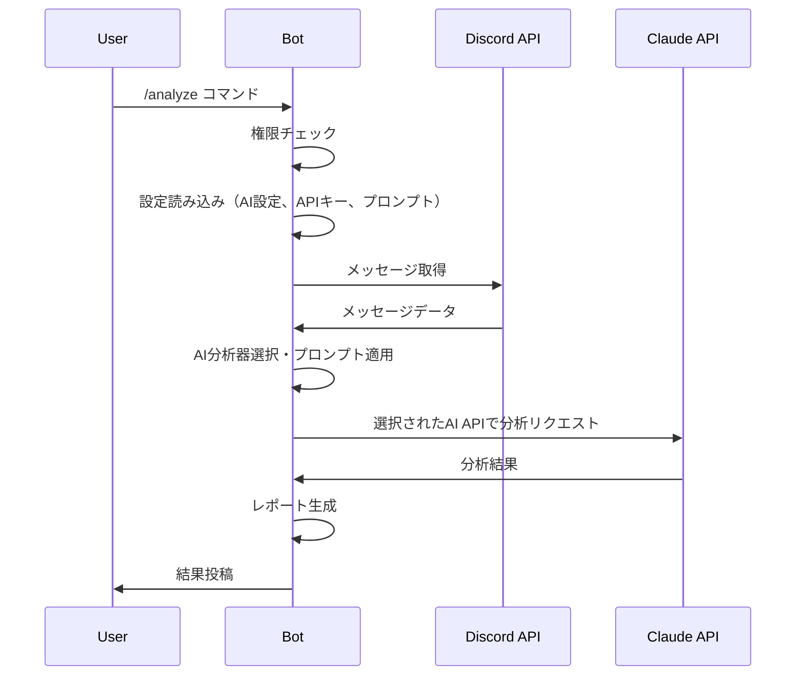
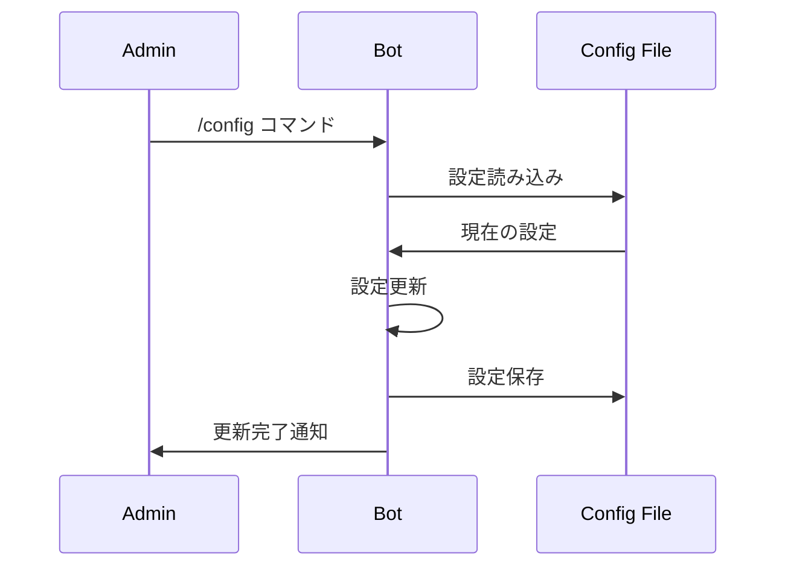
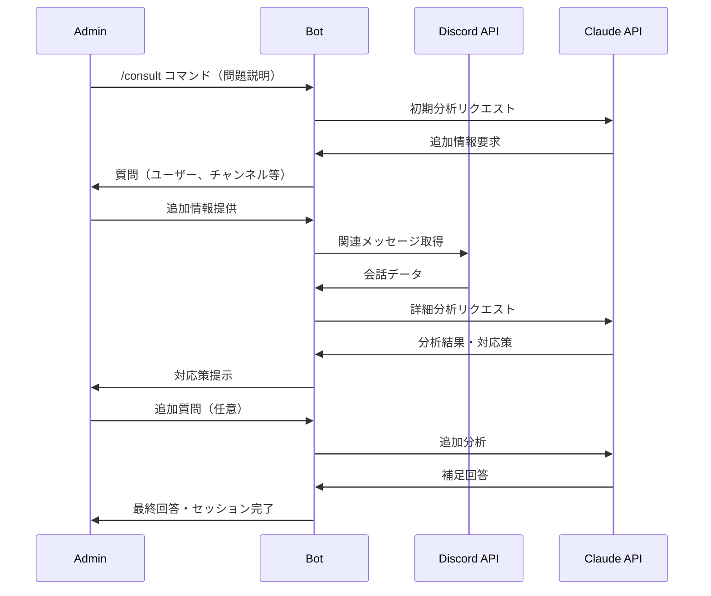

# Discord AI管理Bot 技術仕様書

## 1. システム概要

### 1.1 アーキテクチャ概要
```
Discord Server → Discord.js Bot → Claude API → Analysis Result → Discord Channel
```

### 1.2 技術スタック
- **言語**: TypeScript/Node.js
- **Discord Library**: discord.js v14
- **AI API**: ChatGPT/Gemini/Claude（ユーザー選択）
- **デプロイ**: Railway（無料枠）
- **設定管理**: JSON + GitHub Repository
- **データベース**: なし（リアルタイム取得）

## 2. システム構成

### 2.1 メインコンポーネント

#### 2.1.1 Discord Bot Core
```typescript
// src/bot.ts
- Bot初期化・認証
- コマンド登録・ルーティング
- エラーハンドリング
```

#### 2.1.2 Command Handler
```typescript
// src/commands/
- SlashCommandHandler
- AdminCommandValidator
- CommandRouter
```

#### 2.1.3 Analysis Engine
```typescript
// src/analysis/
- MessageFetcher
- AIAnalyzerFactory
- ChatGPTAnalyzer
- GeminiAnalyzer
- ClaudeAnalyzer
- ReportGenerator
```

#### 2.1.4 Configuration Manager
```typescript
// src/config/
- ServerConfigManager
- ChannelManager
- RuleManager
- APIKeyManager
```

#### 2.1.5 Consult Session Manager
```typescript
// src/consult/
- SessionManager
- ConversationHandler
- ContextBuilder
```

### 2.2 ディレクトリ構成
```
discord-community-bot/
├── src/
│   ├── bot.ts                 # Bot エントリーポイント
│   ├── commands/              # コマンド処理
│   │   ├── analyze.ts
│   │   ├── quick-analyze.ts
│   │   ├── config.ts
│   │   ├── help.ts
│   │   └── consult.ts
│   ├── analysis/              # 分析エンジン
│   │   ├── message-fetcher.ts
│   │   ├── ai-analyzer-factory.ts
│   │   ├── chatgpt-analyzer.ts
│   │   ├── gemini-analyzer.ts
│   │   ├── claude-analyzer.ts
│   │   └── report-generator.ts
│   ├── consult/               # 対話型相談機能
│   │   ├── session-manager.ts
│   │   ├── conversation-handler.ts
│   │   └── context-builder.ts
│   ├── config/                # 設定管理
│   │   ├── server-config.ts
│   │   ├── prompt-manager.ts
│   │   ├── apikey-manager.ts
│   │   └── types.ts
│   ├── utils/                 # ユーティリティ
│   │   ├── logger.ts
│   │   └── error-handler.ts
│   └── types/                 # 型定義
│       └── index.ts
├── config/                    # 設定ファイル
│   └── servers/              # サーバー別設定
│       └── {serverId}.json
├── package.json
├── tsconfig.json
└── README.md
```

## 3. 主要機能の実装仕様

### 3.1 コマンド仕様

#### 3.1.1 `/analyze` コマンド
```typescript
interface AnalyzeCommand {
  name: 'analyze';
  options?: {
    channels?: Channel[]; // 対象チャンネル（未指定時は設定値使用）
    period?: 'today' | 'yesterday' | string; // 期間指定（'today', 'yesterday', 'YYYY-MM-DD'）
    type?: 'summary' | 'detailed' | 'issues'; // 分析タイプ
  };
}

interface QuickAnalyzeCommand {
  name: 'quick-analyze';
  // オプションなし（全て設定値を使用）
}

// 期間処理用のインターフェース
interface DateRange {
  start: Date;
  end: Date;
  label: string; // "今日", "昨日", "2024-01-15"
}

class PeriodParser {
  static parse(period: string, timezone: string = 'Asia/Tokyo'): DateRange;
  static validate(period: string): boolean;
  static getMaxAllowedDate(): Date; // 1週間前の日付
}
```

**処理フロー**:
1. 権限チェック（管理者のみ）
2. 期間パラメータの検証・パース
3. 設定読み込み（対象チャンネル、AI設定、APIキー等）
4. 指定期間のメッセージ取得（Discord API）
5. 選択されたAI APIで分析
6. 結果整形・投稿

**`/quick-analyze` 処理フロー**:
1. 権限チェック（管理者のみ）
2. 設定値読み込み（デフォルト期間、カスタムプロンプト等）
3. 自動でメッセージ取得・分析実行
4. 結果投稿

**期間指定の詳細**:
- `today`: 当日 00:00～現在時刻
- `yesterday`: 前日 00:00～23:59
- `YYYY-MM-DD`: 指定日 00:00～23:59
- 最大1週間前まで（それ以前はエラー）
- タイムゾーン: Asia/Tokyo固定

#### 3.1.2 `/config` コマンド
```typescript
interface ConfigCommand {
  name: 'config';
  subcommands: {
    'channels-add': { channel: Channel };
    'channels-remove': { channel: Channel };
    'channels-list': {};
    'ai-set': { provider: 'chatgpt' | 'gemini' | 'claude' };
    'ai-view': {};
    'apikey-set': { provider: 'chatgpt' | 'gemini' | 'claude', key: string };
    'apikey-remove': { provider: 'chatgpt' | 'gemini' | 'claude' };
    'prompt-set': { prompt: string };
    'prompt-view': {};
    'prompt-reset': {};
    'rules-set': { rules: string };
    'rules-view': {};
  };
}
```

#### 3.1.3 `/consult` コマンド
```typescript
interface ConsultCommand {
  name: 'consult';
  options: {
    situation: string;  // 問題状況の説明
    users?: User[];     // 関係するユーザー（オプション）
    channels?: Channel[]; // 関連チャンネル（オプション）
    timeframe?: string; // 期間指定（オプション）
  };
}

// 対話型セッション管理
interface ConsultSession {
  sessionId: string;
  channelId: string;
  adminId: string;
  status: 'analyzing' | 'waiting_info' | 'providing_solution';
  context: ConsultContext;
  conversation: ConsultMessage[];
}
```

### 3.2 分析エンジン仕様

#### 3.2.1 メッセージ取得
```typescript
interface MessageFetcher {
  fetchMessages(
    channels: Channel[],
    dateRange: DateRange
  ): Promise<Message[]>;

  filterMessages(
    messages: Message[],
    filters: MessageFilter
  ): Message[];

  validateDateRange(dateRange: DateRange): boolean;
}

interface MessageFilter {
  excludeBots?: boolean;
  excludeDeleted?: boolean;
  minLength?: number;
}
```

#### 3.2.2 AI分析インターフェース
```typescript
// 共通分析インターフェース
interface AIAnalyzer {
  analyzeConversations(
    messages: Message[],
    context: AnalysisContext
  ): Promise<AnalysisResult>;

  startConsultSession(
    situation: string,
    context: ConsultContext
  ): Promise<ConsultSession>;

  continueConsultSession(
    session: ConsultSession,
    adminResponse: string
  ): Promise<ConsultResponse>;

  analyzeRelatedMessages(
    session: ConsultSession,
    users: User[],
    channels: Channel[],
    timeframe: TimeRange
  ): Promise<ConversationAnalysis>;
}

// AI プロバイダー別実装
class ChatGPTAnalyzer implements AIAnalyzer {
  constructor(apiKey: string) {}
  // OpenAI API実装
}

class GeminiAnalyzer implements AIAnalyzer {
  constructor(apiKey: string) {}
  // Google Gemini API実装
}

class ClaudeAnalyzer implements AIAnalyzer {
  constructor(apiKey: string) {}
  // Anthropic Claude API実装
}

// ファクトリークラス
class AIAnalyzerFactory {
  static create(
    provider: 'chatgpt' | 'gemini' | 'claude',
    apiKey: string
  ): AIAnalyzer {
    switch (provider) {
      case 'chatgpt': return new ChatGPTAnalyzer(apiKey);
      case 'gemini': return new GeminiAnalyzer(apiKey);
      case 'claude': return new ClaudeAnalyzer(apiKey);
    }
  }
}

interface AnalysisContext {
  serverRules: string[];
  clientRequirements: string[];
  previousReports?: AnalysisResult[];
}

interface AnalysisResult {
  summary: string;
  metrics: CommunityMetrics;
  trends: TrendAnalysis;
  issues: Issue[];
  recommendations: Recommendation[];
}

// 対話型相談関連のインターフェース
interface ConsultContext {
  serverRules: string[];
  clientRequirements: string[];
  previousConsults?: ConsultSession[];
  communityContext: CommunityContext;
}

interface ConsultResponse {
  type: 'question' | 'analysis' | 'solution' | 'completed';
  message: string;
  requiredInfo?: InfoRequest[];
  analysis?: ConversationAnalysis;
  recommendations?: Recommendation[];
  nextSteps?: string[];
}

interface ConversationAnalysis {
  participants: UserProfile[];
  timeline: ConversationEvent[];
  sentiment: SentimentAnalysis;
  keyIssues: Issue[];
  context: string;
}

interface InfoRequest {
  type: 'users' | 'channels' | 'timeframe' | 'context';
  question: string;
  required: boolean;
}

interface ConsultMessage {
  timestamp: Date;
  sender: 'admin' | 'bot';
  content: string;
  type: 'input' | 'question' | 'analysis' | 'solution';
}
```

#### 3.2.3 レポート生成
```typescript
interface ReportGenerator {
  generateReport(
    analysis: AnalysisResult,
    format: 'discord' | 'detailed'
  ): Promise<string>;

  formatForDiscord(analysis: AnalysisResult): DiscordEmbed[];
}
```

### 3.3 設定管理仕様

#### 3.3.1 サーバー設定
```typescript
interface ServerConfig {
  serverId: string;
  serverName: string;
  analyzedChannels: string[];
  aiProvider: 'chatgpt' | 'gemini' | 'claude';
  customPrompt?: string;
  rules: string[];
  clientRequirements: string[];
  adminRoles: string[];
  settings: {
    defaultAnalysisPeriod: 'today' | 'yesterday';
    useCustomPrompt: boolean;
  };
}
```

#### 3.3.2 設定ファイル管理
```typescript
class ConfigManager {
  async loadServerConfig(serverId: string): Promise<ServerConfig>;
  async saveServerConfig(config: ServerConfig): Promise<void>;
  async validateConfig(config: ServerConfig): Promise<boolean>;

  // AI設定管理
  async setAIProvider(serverId: string, provider: AIProvider): Promise<void>;
  async getAIProvider(serverId: string): Promise<AIProvider>;

  // プロンプト管理
  async setCustomPrompt(serverId: string, prompt: string): Promise<void>;
  async getEffectivePrompt(serverId: string): Promise<string>;
  async resetPrompt(serverId: string): Promise<void>;
}

// APIキー管理
class APIKeyManager {
  async setAPIKey(
    serverId: string,
    provider: AIProvider,
    apiKey: string
  ): Promise<void>;

  async getAPIKey(
    serverId: string,
    provider: AIProvider
  ): Promise<string | null>;

  async removeAPIKey(
    serverId: string,
    provider: AIProvider
  ): Promise<void>;

  async hasValidAPIKey(
    serverId: string,
    provider: AIProvider
  ): Promise<boolean>;

  // 暗号化・復号化
  private encrypt(data: string): string;
  private decrypt(data: string): string;
}

type AIProvider = 'chatgpt' | 'gemini' | 'claude';

// プロンプト管理用インターフェース
interface PromptManager {
  getDefaultPrompt(): string;
  buildAnalysisPrompt(
    serverConfig: ServerConfig,
    messages: Message[],
    context: AnalysisContext
  ): string;
  validatePrompt(prompt: string): PromptValidation;
}

interface PromptValidation {
  isValid: boolean;
  errors: string[];
  warnings: string[];
}
```

## 4. データフロー

### 4.1 分析実行フロー


### 4.2 設定管理フロー


### 4.3 対話型相談フロー


## 5. セキュリティ仕様

### 5.1 認証・認可
```typescript
interface SecurityManager {
  isAdmin(userId: string, serverId: string): Promise<boolean>;
  hasPermission(userId: string, action: string): Promise<boolean>;
  validateCommand(command: Command, user: User): Promise<boolean>;
}
```

### 5.2 データ保護
- **メッセージデータ**: 分析後即座に削除
- **設定データ**: 暗号化なし（機密情報含まず）
- **ログ**: 個人情報を含まない形式

### 5.3 レート制限
```typescript
interface RateLimiter {
  checkLimit(userId: string, action: string): Promise<boolean>;
  updateUsage(userId: string, action: string): Promise<void>;
}

// 制限例:
// - /analyze: 1回/時間/ユーザー
// - /consult: 5回/時間/ユーザー
```

## 6. エラーハンドリング

### 6.1 エラー分類
```typescript
enum ErrorType {
  PERMISSION_DENIED = 'PERMISSION_DENIED',
  RATE_LIMIT_EXCEEDED = 'RATE_LIMIT_EXCEEDED',
  DISCORD_API_ERROR = 'DISCORD_API_ERROR',
  AI_API_ERROR = 'AI_API_ERROR',
  CONFIG_ERROR = 'CONFIG_ERROR',
  VALIDATION_ERROR = 'VALIDATION_ERROR',
  API_KEY_MISSING = 'API_KEY_MISSING'
}
```

### 6.2 エラー対応
```typescript
interface ErrorHandler {
  handleError(error: Error, context: ErrorContext): Promise<void>;
  sendErrorMessage(channel: Channel, error: UserFriendlyError): Promise<void>;
  logError(error: Error, context: ErrorContext): Promise<void>;
}
```

## 7. パフォーマンス最適化

### 7.1 メッセージ取得の最適化
- バッチ処理（100件ずつ）
- 並列取得（複数チャンネル）
- 期間フィルタリング（Discord API効率化）
- 日付範囲検証（1週間制限）
- タイムゾーン統一処理

### 7.2 Claude API の最適化
- リクエスト分割（長文対応）
- レスポンス時間監視
- フォールバック機能

## 8. デプロイメント仕様

### 8.1 Railway設定
```yaml
# railway.toml
[build]
builder = "NIXPACKS"

[deploy]
healthcheckPath = "/health"
restartPolicyType = "ON_FAILURE"

[env]
DISCORD_TOKEN = { from = "DISCORD_TOKEN" }
CLAUDE_API_KEY = { from = "CLAUDE_API_KEY" }
NODE_ENV = "production"
```

### 8.2 環境変数
```typescript
interface EnvConfig {
  DISCORD_TOKEN: string;
  CLAUDE_API_KEY: string;
  NODE_ENV: 'development' | 'production';
  LOG_LEVEL: 'debug' | 'info' | 'warn' | 'error';
}
```

## 9. 監視・ログ

### 9.1 ログレベル
```typescript
enum LogLevel {
  DEBUG = 'debug',
  INFO = 'info',
  WARN = 'warn',
  ERROR = 'error'
}
```

### 9.2 メトリクス
- コマンド実行回数
- 分析処理時間
- API呼び出し回数
- エラー発生率

## 10. 今後の拡張性

### 10.1 プラグインアーキテクチャ
```typescript
interface AnalysisPlugin {
  name: string;
  version: string;
  analyze(messages: Message[]): Promise<PluginResult>;
}
```

### 10.2 API拡張
```typescript
interface BotAPI {
  registerCommand(command: Command): void;
  registerAnalyzer(analyzer: AnalysisPlugin): void;
  getMetrics(): Promise<Metrics>;
}
```